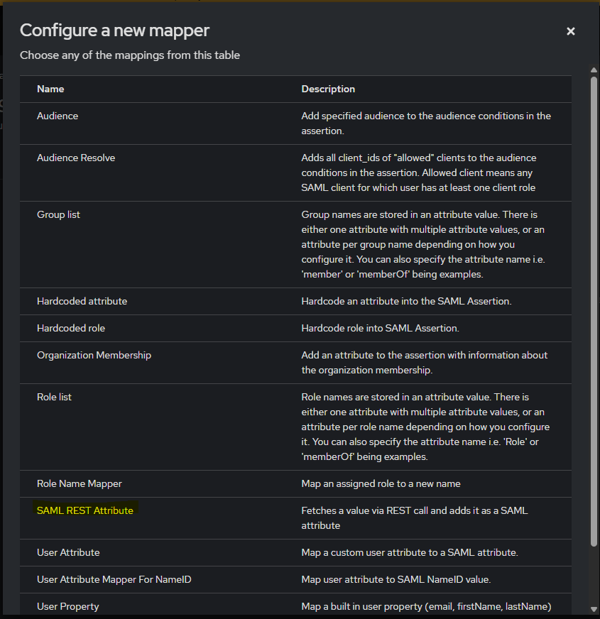
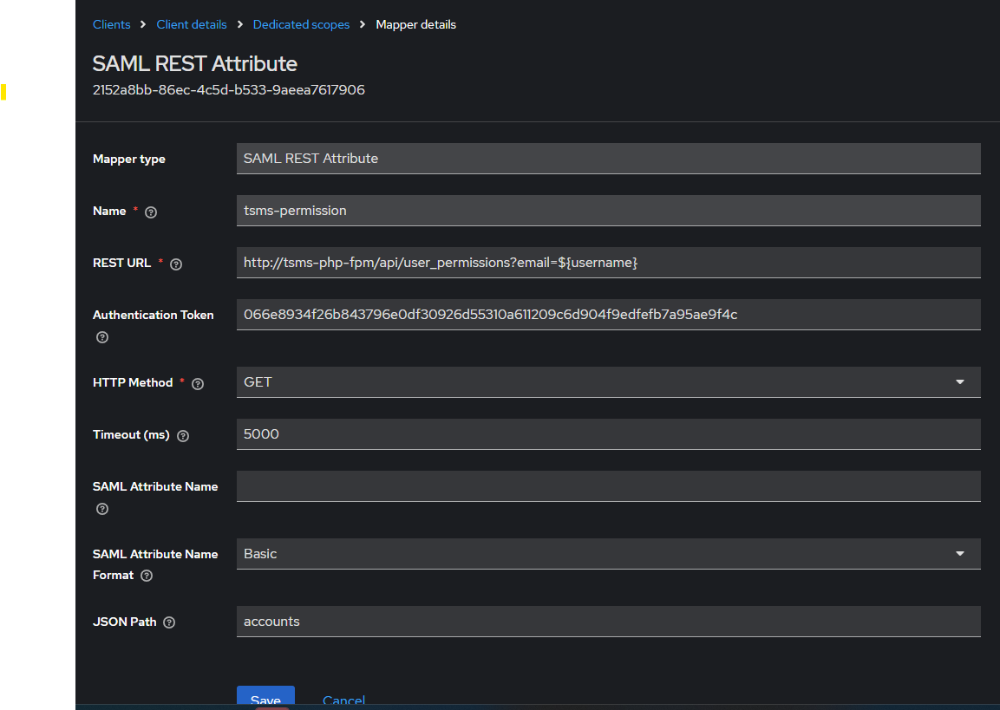
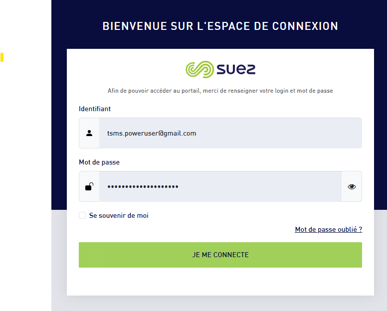
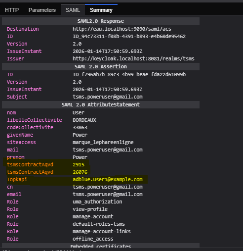
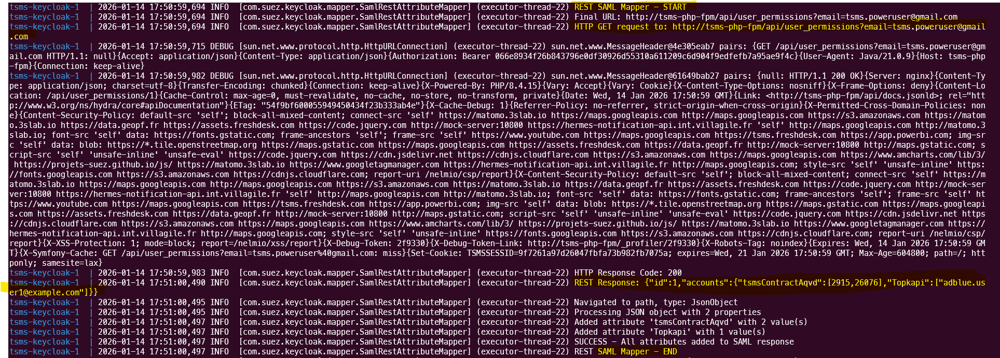
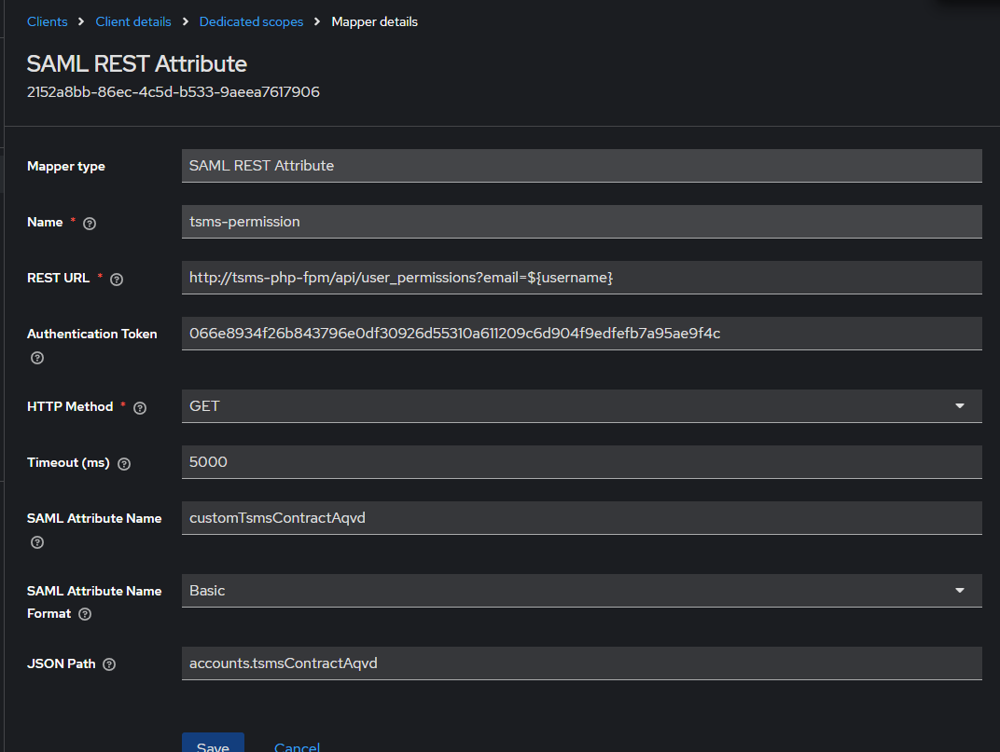
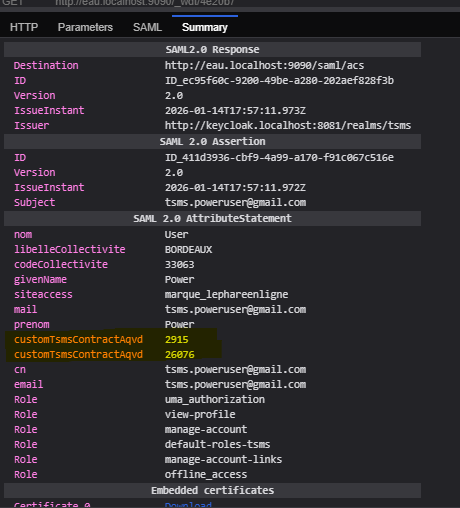

# ✉️ Keycloak SAML REST attribute Mapper

Custom Keycloak SAML mapper that fetches attributes from a REST API and maps JSON responses (object, array, or primitive) into SAML attributes dynamically.


## Features

- Custom Keycloak **SAML Attribute Mapper** based on a REST API call
- Dynamic retrieval of attributes from an external HTTP endpoint during SAML authentication
- Automatic JSON response handling:
    - **JSON Object** → each key is mapped to a separate SAML attribute
    - **JSON Array** → mapped to a single SAML attribute
    - **Primitive values** → mapped to a single SAML attribute
- Configurable SAML attribute name and name format
- Supports multi-valued SAML attributes
- Flexible JSON path selection to target specific parts of the REST response


## Configuration

The mapper provides the following configuration options:

- **REST URL**: URL of the REST service to call. Supports variables `${username}`, `${email}`, `${userId}` (required)
- **Authentication Token**: Bearer token used to authenticate the REST call (optional)
- **HTTP Method**: HTTP method used to call the REST service (`GET` or `POST`, default: `GET`)
- **Timeout (ms)**: Timeout for the REST call in milliseconds (default: `5000`)
- **JSON Path**: Path used to extract a value from the JSON response. If empty, the full response is used (optional)
- **SAML Attribute Name**: Name of the SAML attribute, used only when the response path resolves to a primitive or an array (optional)
- **SAML Attribute Name Format**: URI format of the SAML attribute name (`Basic`, `URI Reference`, `Unspecified`, default: `Basic`)


## Installation

### Option 1: Using Docker

Add the following to your Dockerfile:

```dockerfile
# Download and install the authenticator
ARG SAML_REST_ATTRIBUTE_VERSION="v1.0.0" # x-release-please-version
ARG SAML_REST_ATTRIBUTE_KC_VERSION="26.4.7"
ADD https://github.com/Suezenv/keycloak-saml-rest-attribute-mapper/releases/download/${SAML_REST_ATTRIBUTE_VERSION}/saml-rest-attribute-mapper-${SAML_REST_ATTRIBUTE_VERSION}-kc-${SAML_REST_ATTRIBUTE_KC_VERSION}.jar \
    /opt/keycloak/providers/keyclaok-rest-saml-attribute-mapper.jar
```

### Option 2: Manual Installation

1. Download the JAR file from the [releases page](https://github.com/for-keycloak/keyclaok-rest-saml-attribute-mapper/releases)
2. Copy it to the `providers` directory of your Keycloak installation


## Use Cases
### Use Case 1: SAML attributes directly from a JSON object response
In this use case, the REST API returns a **JSON object**, and each property in the response is automatically mapped to a SAML attribute using the JSON key as the attribute name.

#### Example REST response
```json
{
    "accounts": {
        "tsmsContractAqvd": [
            2915,
            26076
        ],
        "Topkapi": [
            "adblue.user1@example.com"
        ]
    }
}
```
#### Keycloak Configuration

1. Go to your SAML Client

2. Open Client scopes → Dedicated scope

3. Add a new mapper of type REST SAML Attribute
   
4. Configure the mapper as follows:

    - REST URL: https://api.example.com/user/${username}/attributes
    - Authentication Token: your authentication token
    - JSON Path: accounts
    - SAML Attribute Name: (not required for JSON object responses)
    
5. login
    
6. SAML trace
   
7. keycloak logs
   

### Use Case 2: Using a configured attribute name with a JSON array response

In this use case, the REST API returns a JSON array.
All values from the array are mapped to a single SAML attribute using the configured attribute name.

#### Example REST response
```json
{
    "accounts": {
        "tsmsContractAqvd": [
            2915,
            26076
        ],
        "Topkapi": [
            "adblue.user1@example.com"
        ]
    }
}
```
#### Keycloak Configuration
1. Configure the mapper
   Change 
    - SAML Attribute Name: customTsmsContractAqvd
    - JSON Path: accounts.tsmsContractAqvd
      
2. SAML Trace
 
    Attribute SALM = customTsmsContractAqvd



## Local Development

### Prerequisites

- [Just](https://github.com/casey/just)
- Docker & Docker Compose (optional, for testing)

### Building

Using just:
```bash
# Build for the default Keycloak version (26.4.7)
just build

# Build for a specific Keycloak version
just build-version 25.0.6
```


### Testing with Docker Compose

A docker-compose configuration is provided for testing, which includes:

- Keycloak server with the authenticator installed (accessible at http://localhost:8080)
- MailHog for email testing (accessible at http://localhost:8025)

Start the environment:
```bash
just build # Builds the authenticator
just up    # Starts Keycloak with the authenticator
```

```bash
just down  # Stops the environment
```

Access:
- Keycloak: http://localhost:8080 (admin/admin)

## Supported Keycloak Versions

The authenticator is built and tested with multiple Keycloak versions:

- 26.4.7 (default)

While the builds differ slightly for each version, the core functionality remains the same. The version-specific builds ensure compatibility and proper integration with each Keycloak release.


## Contributing

Contributions are very welcome! Whether it's:

- Bug reports
- Feature requests
- Code contributions
- Documentation improvements
- Translations for new languages

Please feel free to submit issues and pull requests.


## Development Notes

The project uses:

- Maven for building
- [just](https://github.com/casey/just) for common development tasks
- Docker & Docker Compose for testing
- Release Please for versioning and release management
- GitHub Actions for CI/CD

See the `justfile` for available commands and development shortcuts.
